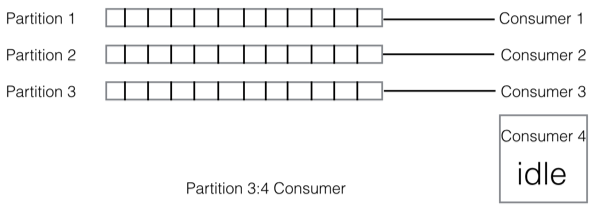
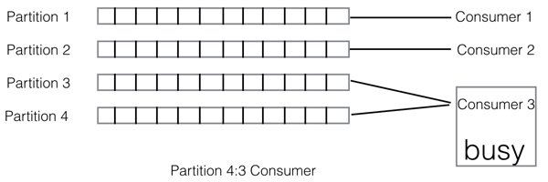

[上一页](install.md)
[回目录](../../README.md)
[下一页](arch.md)

# 设计背景

现在市面上已经有很多消息中间件了(ActiveMQ, RabbitMQ, Kafka, RocketMQ)，那么为什么我们还要造另外一个轮子呢？首先QMQ是2012年就开始开发的，在这个时期其实消息中间件并没有太多的选择，那个时候Kafka还不太成熟,而RocketMQ也没有出现，大部分公司都会采用ActiveMQ或RabbitMQ。
首先RabbitMQ的开发语言是erlang，这是一门略小众的语言，我们担心无法完全掌控，所以没有选择。而ActiveMQ其实在公司内部已有很长一段时间使用历史，但是ActiveMQ太过于复杂，在使用过程中经常出现消息丢失或者整个进程hang住的情况，并且难以定位。

当然，这都是QMQ诞生的历史背景，那么放在今天QMQ还有开源的意义吗？我们比较了市面上现有的消息中间件，仍然认为QMQ有自己的特色，而这些也是我们在过去几年运维消息中间件中觉得必须提供的和难以舍弃的。

我们都知道Kafka和RocketMQ都是基于partition的存储模型，也就是每个subject分为一个或多个partition，而Server收到消息后将其分发到某个partition上，而Consumer消费的时候是与partition对应的。比如，我们某个subject a分配了3个partition(p1, p2, p3)，有3个消费者(c1, c2, c3）消费该消息，则会建立c1 - p1, c2 - p2, c3 - p3这样的消费关系。

那么如果我们的consumer个数比partition个数多呢？则有的consumer会是空闲的。

而如果partition个数比consumer个数多呢？则可能存在有的consumer消费的partition个数会比其他的consumer多的情况。

那么合理的分配策略只有是partition个数与consumer个数成倍数关系。

以上都是基于partition的MQ所带来的负载均衡问题。因为这种静态的绑定的关系，还会导致Consumer扩容缩容麻烦。也就是使用Kafka或者RocketMQ这种基于partition的消息队列时，如果遇到处理速度跟不上时，光简单的增加Consumer并不能马上提高处理能力，需要对应的增加partition个数，而特别在Kafka里partition是一个比较重的资源，增加太多parition还需要考虑整个集群的处理能力；当高峰期过了之后，如果想缩容Consumer也比较麻烦，因为partition只能增加，不能减少。

跟扩容相关的另外一个问题是，已经堆积的消息是不能快速消费的。比如开始的时候我们分配了2个partition，由2个Consumer来消费，但是突然发送方大量发送消息(这个在日常运维中经常遇到)，导致消息快速的堆积，这个时候我们如何能快速扩容消费这些消息呢？其实增加partition和Consumer都是没有用的，增加的Consumer爱莫能助,因为堆积的那3个partition只能由2个Consumer来消费，这个时候你只能纵向扩展，而不能横向扩展，而我们都知道纵向扩展很多时候是不现实的，或者执行比较重的再均衡操作。

基于这些考虑我们并没有直接采用Kafka等基于partition存储模型的消息队列，我们的设计考虑是消费和存储模型是完全解耦的关系，Consumer需要很容易的扩容缩容，从现在来看这个选择也是正确的。现在去哪儿网的系统架构基本上呈现为基于消息驱动的架构，在我们内部系统之间的交互大部分都是以消息这种异步的方式来进行。比如我们酒店的订单变更消息就有接近70个不同的消费组订阅(可以将消费组理解为不同的应用)，整个交易流程都是靠消息来驱动，那么从上面对基于partition模型的描述来看，要在70个不同应用之间协调partition和Consumer的均衡几乎是不可能的。

[上一页](install.md)
[回目录](../../README.md)
[下一页](arch.md)
